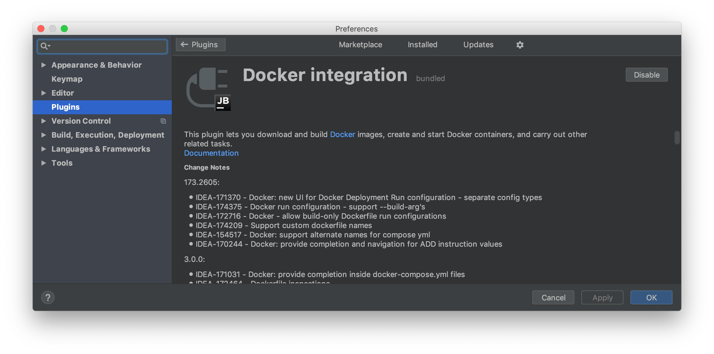
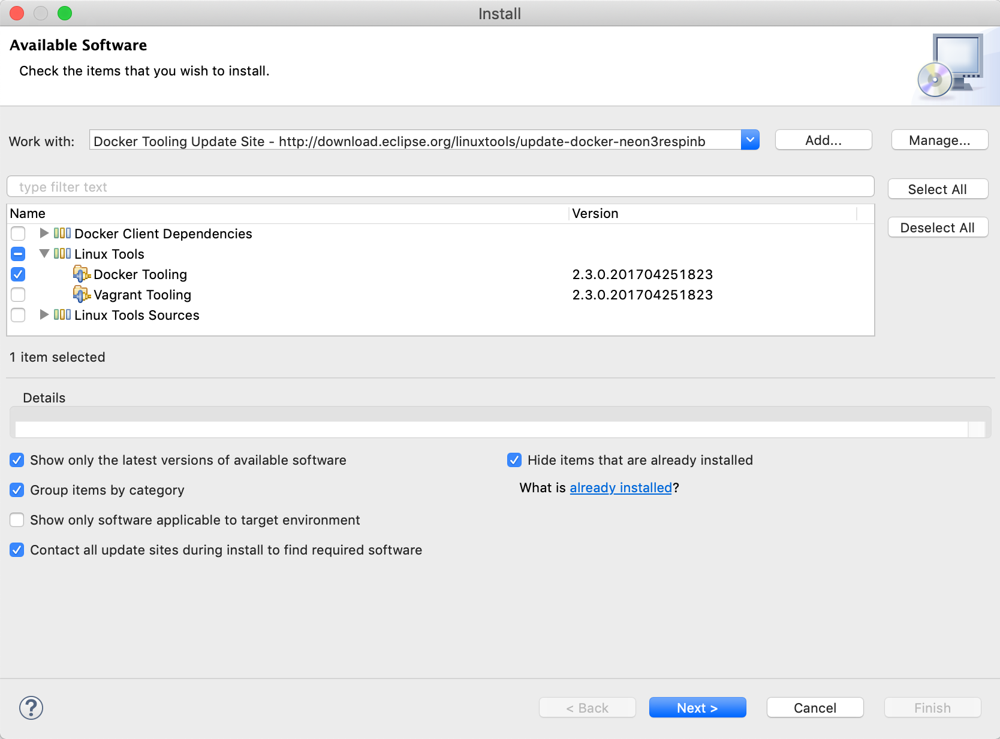
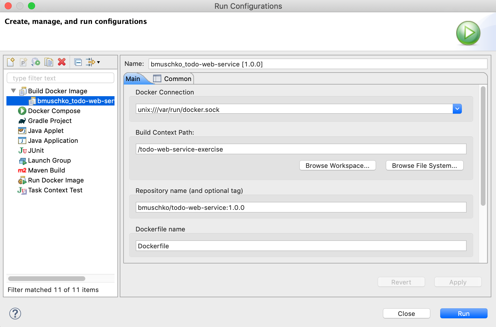
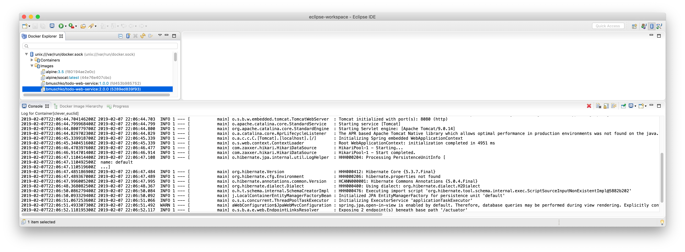
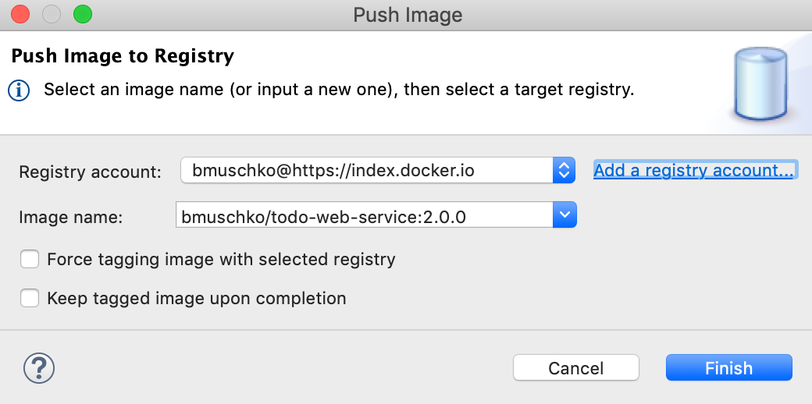

# Solution

## IntelliJ

First, install the plugin via the menu item _IntelliJ IDEA > Preferences... > Plugins_. Search for the plugin with the name "docker integration".

Next, create a new Docker configuration by selecting the `Dockerfile` in the project tree, pressing the right mouse button and selecting "Create Dockerfile". Enter an appropriate image tag and container name.

You can now open the _Docker_ tab on the bottom. Connect to Docker Engine by pressing the play button. Select the Dockerfile again, press the right mouse button and select "Run 'Dockerfile'". That'll start the container. You can inspect the console of the container with the tab "Attached console".

To push the image to Docker Hub, select the image in the Docker browser view, bring up the context menu and select "Push image...".

After pressing the "OK" button, Docker Engine will upload the image. You should see a progress dialog box.

## Eclipse

First, install the plugin via the update site under the menu item _Help... > Install New Software..._. Enter the relevant update site URL (click [download button](https://marketplace.eclipse.org/content/eclipse-docker-tooling)). Select the "Docker Tooling" and install the software.

In the Java perspective, select the `Dockerfile`, open the context menu and select _Run As... > Docker Image Build_.

In the Docker Tooling perspectice, connect to Docker Engine, open the "Images" tree and select the image you want to run. In the context menu, click "Run...". You will see the attached console below.

To push the image to Docker Hub, select the image in the Docker Explorer view, bring up the context menu and select "Push...". You may have to enter your Docker Hub credentials.

After pressing the "OK" button, Docker Engine will upload the image. You should see a progress in the lower-right corner of the screen.