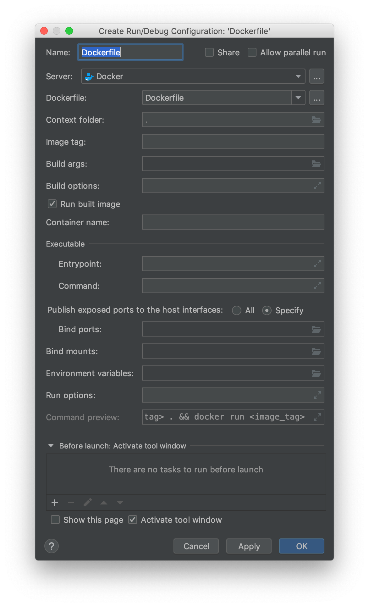
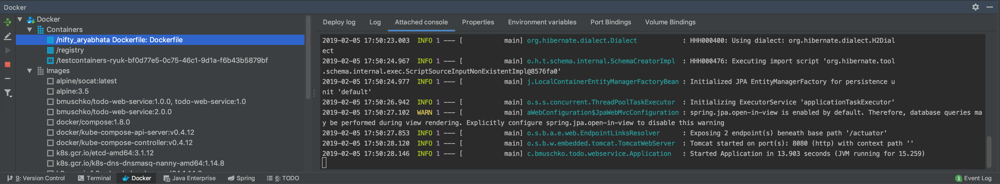
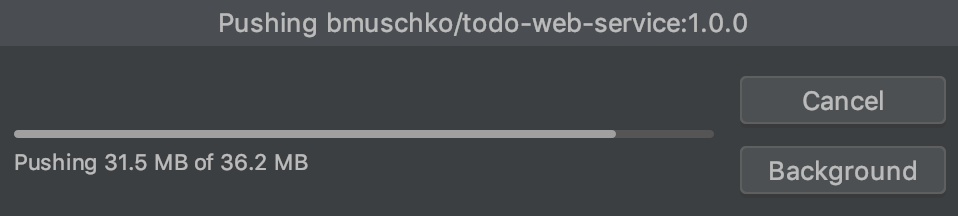

# Solution

## IntelliJ

First, install the plugin via the menu item _IntelliJ IDEA > Preferences... > Plugins >_. Search for the plugin with the name "docker integration".

Next, create a new Docker configuration by selecting the `Dockerfile` in the project tree, pressing the right mouse button and selecting "Create Dockerfile". Enter an appropriate image tag and container name.

You can now open the _Docker_ tab on the bottom. Connect to Docker Engine by pressing the play button. Select the Dockerfile again, press the right mouse button and select "Run 'Dockerfile'". That'll start the container. You can inspect the console of the container with the tab "Attached console".

To push the image to Docker Hub, select the image in the Docker browser view, bring up the context menu and select "Push image...".

After pressing the "OK" button, Docker Engine will upload the image. You should see a progress dialog box.

